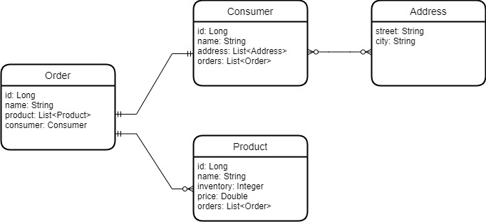

# Projeto Mongo database

    Este projeto foi feito para a disciplina PERSISTENCE do curso de 
    MBA EM FULL STACK DEVELOPMENT - DESIGN, ENGINEERING & DEPLOYMENT
    da turma 43scj.

    Nesse projeto é uma API foi feito em JAVA(version 18) com springboot framework onde é simulado
    um ambiente de vendas através de rotas e salvando com jpa repository com SQL.

    As rotas existentes no serviço são:
    GET  ->  getAllOrders        -> /{id}
    GET  ->  getAllConsumers     -> /
    POST ->  saveOrderByConsumer -> /

    No serviço possuimos as entidades Consumer(consumidor), Order(pedido), Product (produto)
    e Address(endereço).

    Diagrama de classes: 

    Os consumidores possuem suas proprias informações e
    também possuem orders e endereços (uma lista de possíveis endereços).
    Uma order possui produtos e cada produto é composto por  name, inventory, quantity e price.

    O fluxo de compra é feito chamando a rota POST ( / ) e dessa forma temos um pedido
    cadastrado. O corpo Json necessário para executar a requisição é:
    {
        name: String,
        phone: String,
        cpf: String,
        address: [
            {   
                street: String,
                city: String
            }
        ],
        order: [
            product: [
                {
                    name: String,
                    inventory: Number,
                    price: Number,
                    quantity: Number
                }
            ]
        ]
    }

    Para configurar o ambiente do Mongo Database é necessário criar o arquivo
    application.properties com os dados:

    spring.data.mongodb.host=
    spring.data.mongodb.port=
    spring.data.mongodb.database=
    spring.data.mongodb.auto-index-creation=true
